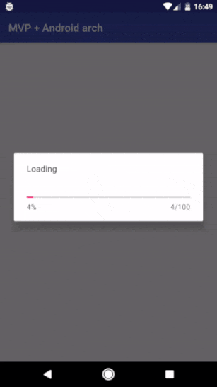
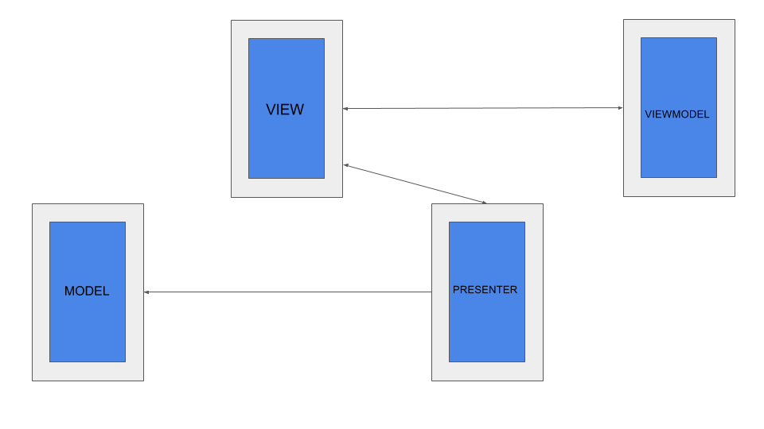
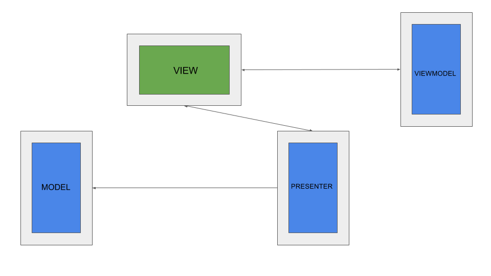

# MVP + Android Architecture Components = 💗

This is a sample project, showing the connection between Android Architecture Components and MVP pattern. 
The library is coming soon.  
[Android Architecture Components][0] 

[0]: https://developer.android.com/topic/libraries/architecture/index.html

 
## How it works
-----------------------

**1. Before orientation change**

-----------------------
**2. After orientation change**

## More coming soon.

## Contact

Pull requests are more than welcome.

- **Email**: armcha01@gmail.com
- **Facebook**: https://web.facebook.com/chatikyana
- **Twitter**: https://twitter.com/ArmanChatikyan
- **Google +**: https://plus.google.com/+ArmanChatikyan
- **Website**: https://armcha.github.io/

License
--------

      Space Navigation library for Android
      Copyright (c) 2017 Arman Chatikyan (https://github.com/armcha/MVP-Architecture-Components).

      Licensed under the Apache License, Version 2.0 (the "License");
      you may not use this file except in compliance with the License.
      You may obtain a copy of the License at

         http://www.apache.org/licenses/LICENSE-2.0

      Unless required by applicable law or agreed to in writing, software
      distributed under the License is distributed on an "AS IS" BASIS,
      WITHOUT WARRANTIES OR CONDITIONS OF ANY KIND, either express or implied.
      See the License for the specific language governing permissions and
      limitations under the License.

